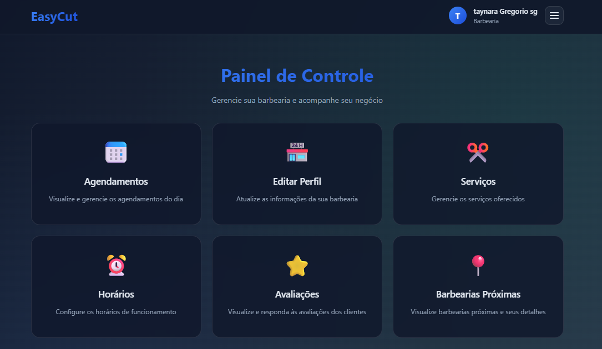
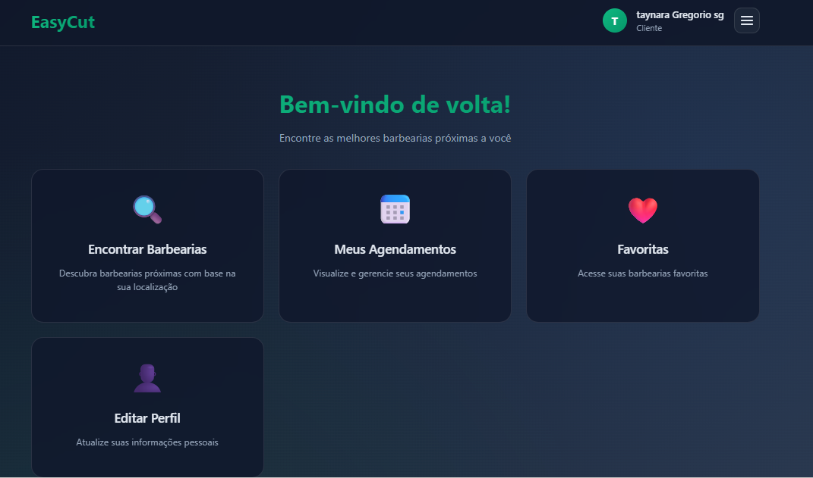
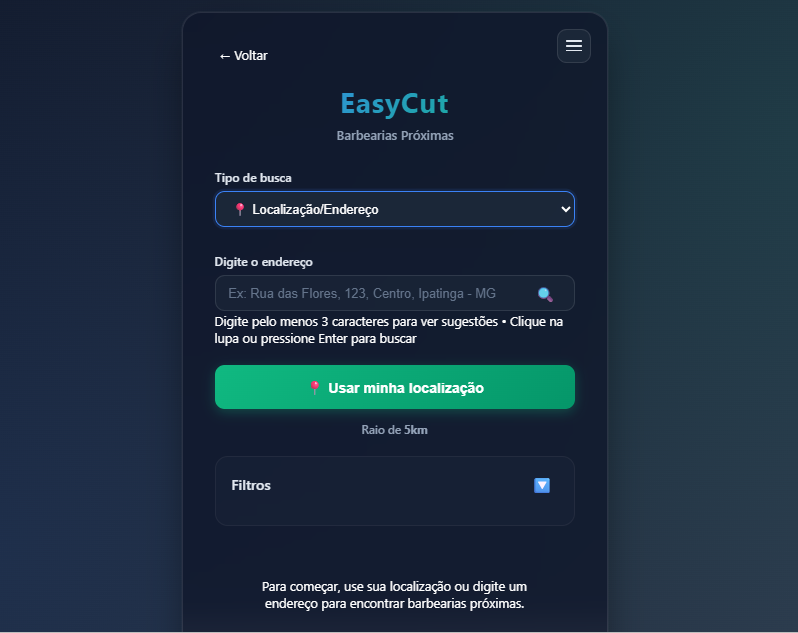

# 💈 EasyCut

Sistema web desenvolvido para conectar usuários a barbearias próximas, permitindo agendamentos de serviços de forma prática, rápida e intuitiva.

---

## 📌 Sobre o Projeto

O **EasyCut** é uma aplicação criada com o objetivo de facilitar a busca por barbearias e o agendamento de serviços como corte de cabelo e barba.

A plataforma permite que usuários encontrem estabelecimentos com base em localização ou busca por nome, visualizem informações detalhadas e realizem agendamentos conforme a disponibilidade.

Além disso, barbearias podem gerenciar seus horários, serviços e interações com clientes, tornando o sistema uma solução completa para ambos os lados.

---

## 🚀 Funcionalidades

### 👤 Para Clientes
- Cadastro e login
- Busca de barbearias por nome ou localização
- Visualização de detalhes das barbearias
- Agendamento de serviços (data e horário)
- Histórico de agendamentos
- Avaliação de serviços (nota e comentário)

### 💈 Para Barbearias
- Cadastro de estabelecimento
- Gerenciamento de perfil e serviços
- Controle de agenda
- Aceitar ou recusar agendamentos
- Configuração de horários de atendimento

### ⚙️ Sistema
- Geolocalização de barbearias próximas
- Notificações (lembretes, confirmações, promoções)
- Armazenamento de histórico
- Segurança de dados conforme LGPD

---

## 🧠 Diferenciais

- Integração entre agendamentos e avaliações no banco de dados  
- Sistema completo com múltiplos atores (cliente e barbearia)  
- Uso de geolocalização para melhorar a experiência do usuário  
- Interface projetada com foco em usabilidade e acessibilidade  
- Aplicação de boas práticas de Engenharia de Software e IHC  

---

## 🛠️ Tecnologias Utilizadas

- JavaScript  
- Python
- HTML e CSS  
- Banco de Dados Relacional  

---

## 🗄️ Banco de Dados

O sistema utiliza um banco de dados relacional estruturado com diversas entidades, como:

- **Clientes**
- **Barbearias**
- **Agendamentos**
- **Serviços**
- **Horários**
- **Avaliações**

📌 Destaque:
A tabela de **agendamentos** armazena informações como:
- data e horário
- status do atendimento
- valor total
- nota e comentário da avaliação

Isso permite integrar diretamente o histórico de serviços com o sistema de avaliações.

---

## 🎨 Interface e Usabilidade

O projeto foi desenvolvido com foco em:

- Interface intuitiva e organizada  
- Navegação simples e acessível  
- Responsividade para diferentes dispositivos  
- Aplicação de diretrizes de acessibilidade (WCAG)  
- Feedback visual para ações do usuário  

Foram realizadas:
- Avaliações heurísticas  
- Testes de usabilidade com usuários  
- Protótipos iterativos  

---

## 📸 Demonstração

### 💈 Dashboard da Barbearia

### 👤 Dashboard do Cliente

### 🔍 Visualização de Barbearias
